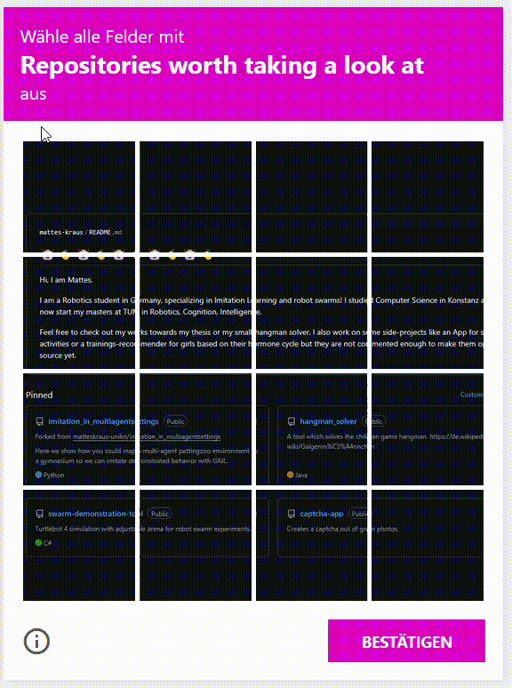

# Captcha App

Here you can add whatever picture you like and get an infinite loop of captchas with all the custom captchas you configured in the app's data. See live example [here](https://captcha.matteskraus.de).



---

## 🚀 Installation & Setup

This is an Expo project. To get it running on your local machine, follow these steps:

1. **Install dependencies:**
   ```bash
   npm install
   ```

2. **Start the Expo development server:**
   ```bash
   npx expo start
   ```
   You can then scan the QR code with the Expo Go app on your phone, or run it on an iOS/Android emulator.

---

## 🖼️ How to Add Custom Captchas

The best feature of this app is that you can easily turn any image into a functional captcha! The grid is always sliced into 4x4 tiles.

### Step 1: Add your image
Place your desired square image (e.g., `.jpg` or `.png`) into the following folder:
`/assets/captchas/`

### Step 2: Configure the Captcha data
Open the file `/app/captcha-data.tsx`. Locate the `CAPTCHA_LIST` array and add a new entry for your image. 

The structure looks like this:

```javascript
{
  imageUrl: require('../assets/captchas/YOUR_PICTURE.jpg'),
  instructionText: 'Select all squares with YOUR_CAPTION',
  solutionMap: {
    // Define the correct tiles here
    "0,0": true,
    "1,2": true,
    "3,3": true
  },
}
```
*(Note: Depending on your exact implementation, you might also use your `createSolutionMap(4, ["0,0", "1,2", "3,3"])` function to generate the `solutionMap` object automatically).*

### 🗺️ Understanding the Coordinate System

The app uses a grid coordinate system `(x,y)` to determine which tiles are the correct answers. 
* **`0,0`** is the **top-left** tile.
* **`x`** goes from left to right (0 to 3).
* **`y`** goes from top to bottom (0 to 3).

**4x4 Grid Reference:**
|       | x = 0 | x = 1 | x = 2 | x = 3 |
| :---: | :---: | :---: | :---: | :---: |
| **y = 0** | 0,0 | 1,0 | 2,0 | 3,0 |
| **y = 1** | 0,1 | 1,1 | 2,1 | 3,1 |
| **y = 2** | 0,2 | 1,2 | 2,2 | 3,2 |
| **y = 3** | 0,3 | 1,3 | 2,3 | 3,3 |

Simply find the coordinates of the tiles that contain the target object and add them to your `solutionMap`.
